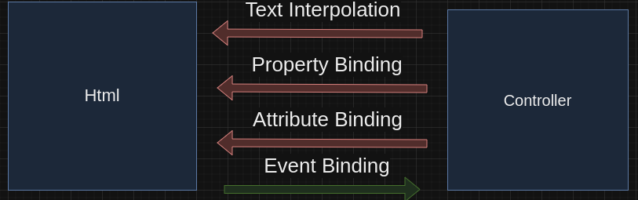
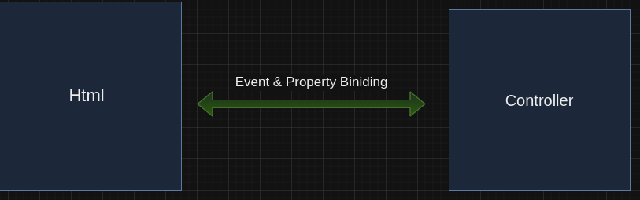

# Data Binding
In angular, There are 2 Types of data binding

## 1 - One Way Binding
in one way binding the data can be transfered from component controller `x.component.ts` to component html `x.component.html` but only in one direction


in brief
```
I can get data from controller to represent in html

I can get data/event from html to do some processes in controller
```
### Types
1) Text interpolation
2) Event Bining
3) Property Binding
3) Attribute Binding



## 2 - Two way Binding
- in two way binding the data can be transfered from component controller `x.component.ts` to component html `x.component.html` in both direction
- Two-way binding combines `property binding` with `event binding`

